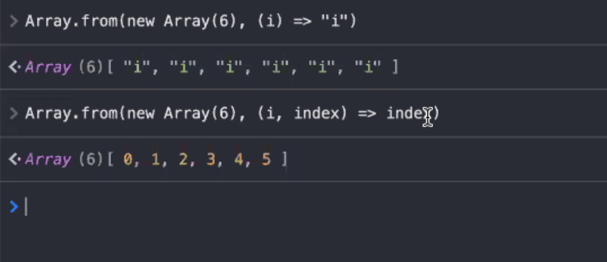

# **ARRAYS**

Una lista de expresiones separadas por comas entre corchetes.
Usaremos una array cada vez que quereamos garantizar el orden de algo.

    const emptyArr = []
    const arr = (1 + 2)
    const matrix=
    [[1,2,3],
    [4,5,6],
    [7,8,9]];

_Una array dentro de otra array_

En una array podemos meter valores undefined

`const sparseArr =[1,,,,5]`
 

### **INICIALIZADORES DE ARRAY**  

    const arr = [1,2,3, -1.2];
    const p = {x:2.3, y: arr[3]};
    q.x acceso

 

Carece de tipos, dentro puede haber cualquier cosa.
Objetos u otros arrays. Pudiendo ser un array de arrays, filas y columnas
Tienen un base 0, y es dinámico, no hace falta declarar su tamaño
Su longitud se nombra con length
   

 

>  
>
> # **쮺칩mo se puede crear un Array?**
>
> Literal de array : [ ] 
> Split operator : ... 
> Array() 
> Array.of 
> Array.from: 
> Espera recibir un iterable o un objeto parecido a un array,
> Array.from(original); [...original]    > >
>
> let d = Array.of() retorna un array vacia
>
> let e = Array.of(10); [10]
>
>  

 
 

    const base = 1024;
    const table = [base, base + 1, base + 2]

    const x = [1, , 3]; 
    const y = [, ,]; un array con 3 posiciones vacias 

    const a = [1,2,3]; 
    const b = [0, ...a, 4]; [0,1,2,3,4] 

    const original = [1,2,3]; 
    const copy = [...original]; 

    copy[0] = [0]; 
    original[0]; 

`const digits = [..."0123456789"];` me convierte este array en una array con strings diferentes
 
 
 

## **SET**

El set no admite valores duplicados y es iterable (IVESTIGAR MAS)

`let a = new Array();` esto crea un array vacio MEJOR USAMOS LITERALES

`const roll = Array.from(new Array(4), () => Math.floor(Math.random()\* 6) + 1)`
  

## **LENGTH**

`const a = [1,2,3,4,5] a.length = 3 a = [1,2,3]`

El length es un invariante y no lo debemos tocar
 
 

## **METODOS DE ARRAYS**

**a.push:** Añadimos elementos al final del array 
**a.unshift:** Añadimos elementos al principio del array 
**a.pop:** Quita el último elemento y te lo devuelve 
**a.shift:** Quita el primero y te lo devuelve 
**a.includes:** Te dice si algo está incluido dentro de un array 

**delete a[1]**: borra la posicion 1 pero no varia el length

**a.splice** coge la posición y te devuelve el elemento   

   

## **ITERANDO ARRAYS**

### **FOR OF**

Vale para iterar arrays a strings pero nos quedamos sin los índices.
  

 

 

  

### **MÉTODOS DE ITERACIÓN DE UN ARRAY**

Todos estos aceptan una función y la invocan por lo menos una vez, normalmente esta función es invocada con cada elemento del array.

### **FOR EACH**

**arr.forEach** nos saca todo lo que hay en este array tantas veces como elementos haya, recorre pero no devuelve nada.
  

## **MAP**

Le pasa cada elemento del array pero devuelve otro array
ESTE RECORRE Y DEVUELVE UNA NUEVA ARRAY PERO SIN MODIFICAR LA PRIMERA.  

  

  

 
 

## **FILTER**

Nos permite filtrar, retorna true o false.

`const a = [5,4,3,2]; a.filter((value) => value < 3); 2`

FILTER DEVUELVE UN ARRAY
  

## **FIND**

TE BUSCA UN ELEMENTO Y TE LO DEVULVE, EL PRIMERO QUE CUMPLA LA CONDICIÓN
  

## **EJEMPLO INGREDIENTES**

    `const ingredientes = ["🌽", "🐮", "🐔"];
    const cocinar = (ingrediente) => {
    switch (ingrediente) {
    case "🌽":
    return "🍿";
    case "🐮":
    return "🍔";
    case "🐔":
    return "🍗";}};
    const esVegetariano = (ingrediente) => {
    switch (ingredientes) {
    case "🌽":
    return true;
    case "🐮":
    return false;
    case "🐔":
    return false;}};
    const esPollo = (ingrediente) => ingrediente === "🐔";
    ingredientes.map(cocinar); // [ "🍿", "🍔", "🍗" ]
    ingredientes.filter(esVegetariano); // ["🌽"]
    ingredientes.find(esPollo); // "🐔"`

## **REDUCE**

Ver enlace https://www.freecodecamp.org/news/reduce-f47a7da511a9/

Metodo funcional del array, recorre el array y sus elementos y genera un único valor

El 0 final es el acumulador incial, y el next es el 1, los suma, despues el acc es 1 y next 2 y los suma, y así va sumando todo.  

 

