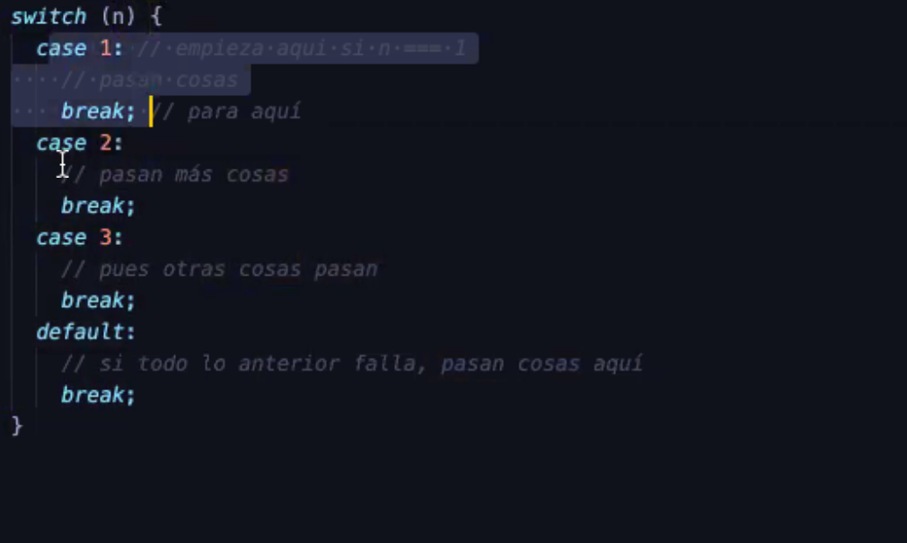
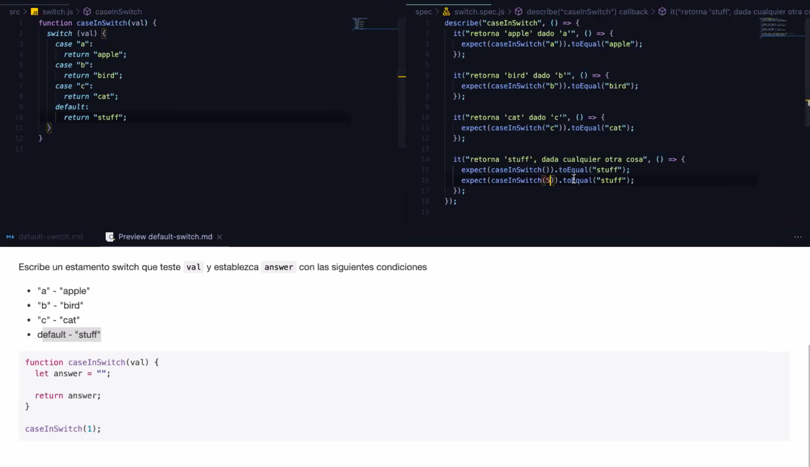
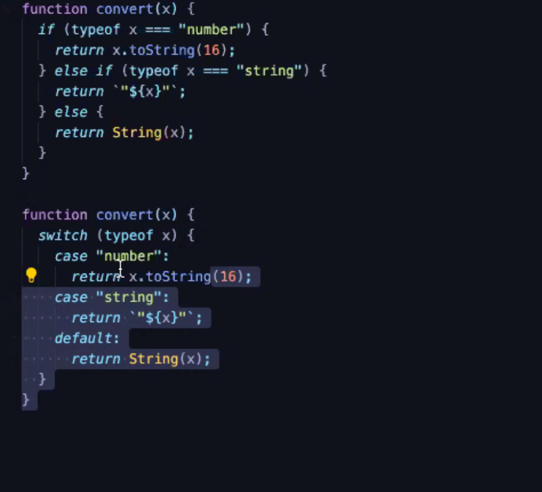
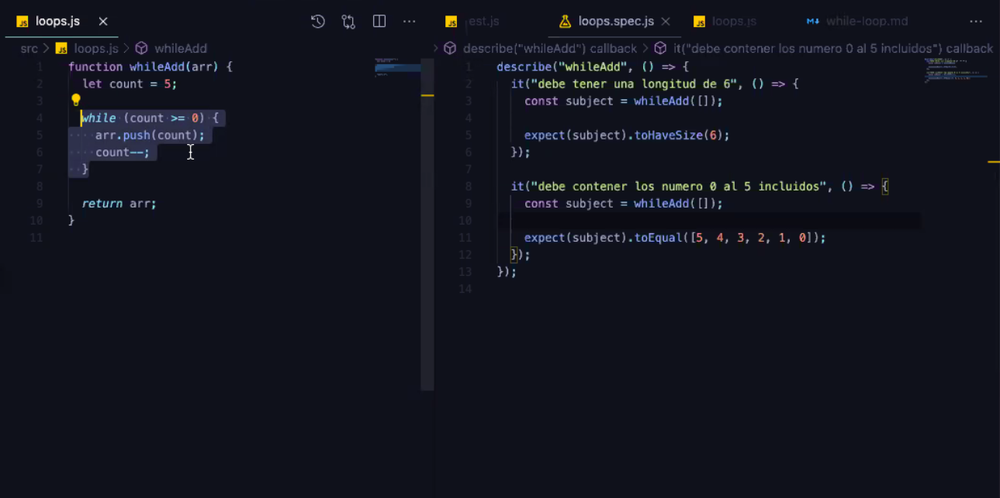
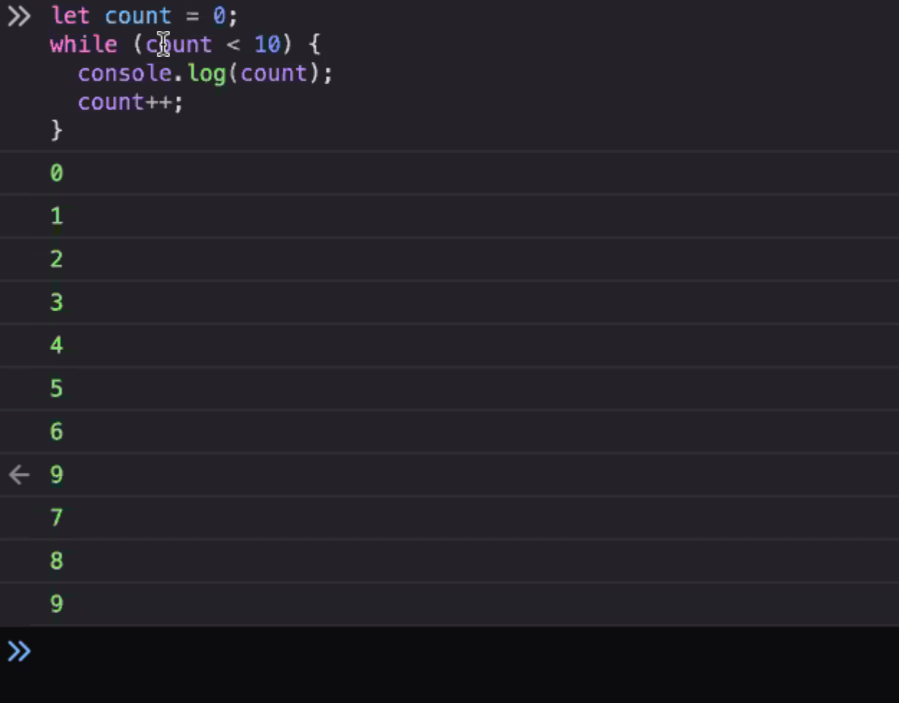
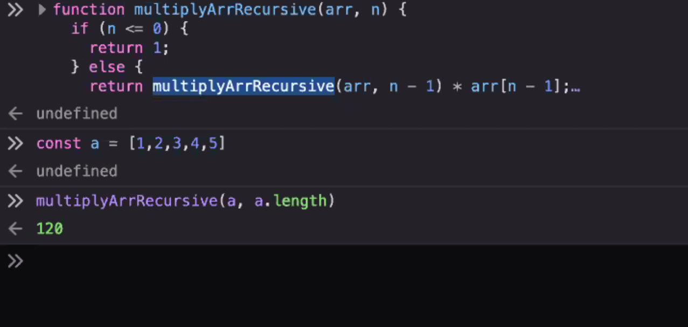
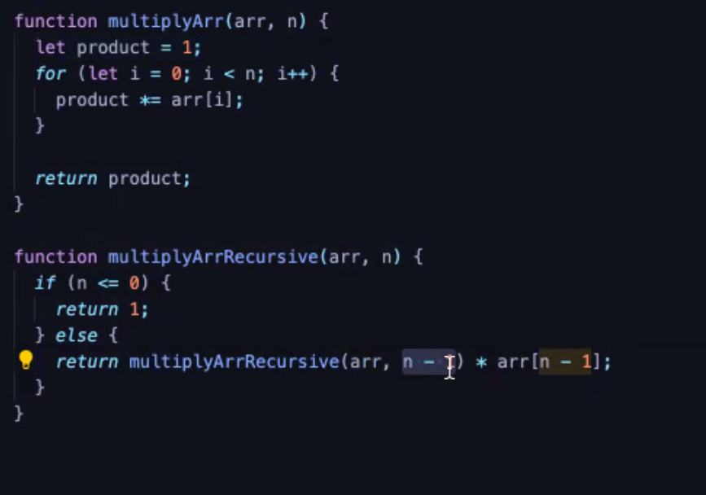

# TEMPLATES STRINGS

const name = "Moni";
const greeting = `Hello ${name}.`;

const message ="Saludos desde casa"
const name ="Moni";
console.log(`Hola: ${name}!

${message}
`);

\0 es un null
\t tabulación
\back slash, es para hacer que se muestre lo que viene a continuación

### **-DENTRO DE UN TEXTO ENCONTRAR PATRONES**

> <br>
>
> ### **EXPRESION REGULAR REGEXP**
>
> RegExp, son literales, definen patrones
> PARA CREAR REGEX
> www.regex101.com
>
> <br>

<br>

> <br>
>
> ### **BOOLEANO**
>
> OPERADORES asi generamos booleanos
> Estructuras de control, nos sirve para que el código vaya por un lado o por otro
>
> <br>

a !== null , para saber si algo es null o undefined
<br>

> <br>
>
> #### **3 OPERADORES BOOLEANOS**
>
> - && AND, EVALUA UN VALOR VERDADERO true&&true solo si los dos son verdaderos, sino sería falso
> - || OR, EVALUA UN VALOR VERDADERO SI UNO DE LOS DOS ES VERDADERO Y SI LOS DOS SON FALSOS EVALUA >FALSO
> - ! NOT, NIEGA
>
> <br>
> <br>

true; verdad<br>
false; falsedad

Son el resultado de una comparación

```js
myVar === 5;
if (myVar === 5) {
  myVar2++;
} else {
  myVar--;
}
```

Cualquier valor puede ser convertido en booleano

FALSE
undefined;
null;
0 - 0;
NaN;

if ()

! NEGACIÓN

```js
const x = 1;
!(x === 0);
(x === 0 && y === 0) || !(z === 0);
```

> API LO QUE TE OFRECE UNA FUNCIÓN

> NULL, AUSENCIA DE VALOR | CASI SIEMPRE ES MEJOR USAR NULL, PARA >INDICAR AUSENCIA DE VALOR, SIEMPRE COMPARAMOS CON == NO CON ===, >PERO PARA EL RESTO SI USAMOS ===
> typeof null

<br>

## **UNDEFINED**

<br>
AUSENCIA DE VALOR, MÁS PROFUNDO, CUANDO NO INICIALIZAMOS UNA VARIABLE
ES EL VALOR DE RETORNO DE LAS FUNCIONES QUE NO RETORNAN NADA
ES UNA CONSTANTE GLOBAL

### **NULL Y UNDEFINED NO HAY MÉTODOS** <br>

LOS SÍMBOLOS, son únicos, si no conoces el símbolo no puedes acceder al objeto
Mecanismo de extensión de lenguaje
son proppiedades que no son strings, propiedades de un objeto, que les aporta privacidad
Los objetos fundamentales, son una colección no ordenadas de propiedades const o = { foo : 1};
o.foo

const strname ="string name";
const symbolname

## **OBJETO GLOBAL**

Sus propiedades sirven como identificador.<br>
**window.console.log** <br>

    Como es global siempre está ahí y no hace falta que lo nombremos.   Todo lo que está dentro del objeto global es una palabra  reservada.
    Cada navegador puede meter unas funciones en window.
    window se ha unificado como globalThis, nosotros vamos a usar   globalThis

## **JAVA SCRIPT ISOMÓRFICO**

Es compatible con NODE y con los navegadores

HAY UNA DIFERENCIA ENTRE PRIMITIVOS Y OBJETOS
Los primitivos son inmutables, no se puede cambiar
STRINGS SON ARRAYS DE CARACTERES
Un método hace que de un string me devuelvas otro string
dos strings solo son iguales si tienen exactamente los mismos caracteres

Los objetos son tipos referenciales,
Los valores objeto son referencias, y solo son iguales si referencian el mismo objeto subyacente

LA DECLARACIÓN TIENE QUE ESTAR ANTES DEL USO
let variable
const constante
const te obliga a inicializar, y no puede mutar

scope la región donde estan definidos let y const {}
nuestro scope global es el archivo, pero normalmento limitaremos su uso entre {}

let y const, no pueden hacer referencia al mismo objeto, osea no puede haber un let x = 1, const x = 1

Hoisting
Capacidad de acceder a una variable antes de ser declarada, esto pasaba antes de ecma script 6
https://www.udemy.com/course/the-web-developer-bootcamp/

## **EXPRESIONES**

**¿Que es una expresion?** <br>
Es una frase evaluada (evaluar es lo que pinta, el valor que tiene algo cuando se ejecuta el código, su resolución. Para producir un valor, una constante es una expresión por ejemplo.
Expresiones primarias, son literales o constantes o palabras del lenguaje, o palabras reservadas.
<br><br>

> 1.43<br>
> "hello"<br>
> /pattern/g<br>
> this - no es constante, retorna el objeto del que el método ha sido invocado<br>
> referencia a las var/const const i = 0;
> <br> <br>

## **DEFINICIÓN DE FUNCIONES**

    function square = function (x) {
    return x \* x;}
    x = 4;
    cont sum = fuction (x, y){
    return x + y;}

## **ARROW FUCTION**

const sum = (x, y) => x + y;<br><br>

## **EXPRESIONES DE ACCESOS A LAS PROPIEDADES DE OBJETOS**

<br>

    const a = [o, 4, [5, 6]];
    const o = { x: 1, y: {z: 3 } };

    o.x;
    o.y.z;
    o["x"];
    a[1];
    a[2][1];
    a[0].x;
    a[0.y];

## **Acceso condicional (accedes si existe)**

```js
expresion?.identificador;
expresion?.[expresion];

let a = { b: null };
a.b?.c.d;

const a = { y: { z: null }, x: 1 };
```

Si (a) es null o undefined y (b) no existe no accedas a (c) o (d), pero si existe si accede, porque nos da typeError, pero si accedemos con ? evitamos el typeError. Si no existe te lo evalua como undefined. <br><br>

## **CONVERSIÓN DE TIPOS IMPLICITOS**

<br>
Java script es muy flexible.
Si java script espera un string todo lo que vaya dentro te lo convertirá en string.

```js
"7" * "3";
21; //convierte los strings en números
true == 1;
true;
false == 0;
true;
"" == 0;
false;
```

## **NOSOTROS SIEMPRE VAMOS A USAR ===**

### **NUNCA USAMOS ==**, Solo para x == null

CONVERSIÓN EXPLICITA

```js Number ("3")
const n = Number("3");
const n = 2;
n.toString();
("2");
```

**n.toFixed (5):** reducir los decimales a 5, es para convertir un string númerico. <br>
**parseInt**, te convierte a strings a números y redondea. <br>
**parseInt ("3.2")**

DE LOS OBJETOS
BOOLEANO, TODO OBJETO CONVIERTE A TRUE
STRING, PRIMERO CONVIERTE A PRIMITIVO, LLAMA a toString

console.log log es el metodo del objeto console

## **INVOCAR**

calculadora.sum (1, 2)
sum (1, 2)

## **EXPRESIONES DE CREACIÓN DE OBJETOS NO FUNDAMENTALES**

const o= {} ESTE ES FUNDAMENTAL

Para inicializar las propiedades del objeto invocamos Date, x ejemplo

const d = new Date
<br><br>

# OPERADORES

typeof 1
delete: tenemos un objeto con una propiedad x
delete o.x te borra x dentro de o

los operadores tienen un orden de preferencia
Se categorizan por el número de operandos que esperan, aridad, la multiplicacion por ejemplo tiene 2 1\*4

OPERADOR TERNARIO O CONDICIONAL, ¿es esto cierto? entonces haz esto sino esto otro
opera con 3 expresiones en una sola
x > 1 ? console.log("mayor") : console.log("menor");
Esperan que sus operandos sean de un solo tipo, 3 \* "5", espera un resultado numérico, pero se van comportando diferente dependiendo de que operandos le des

EFECTOS SECUNDARIOS
Operador de incremento x++, estos tienen un efecto sobre el programa
x--
Hay operadores textuales y otros solo de notación, aridad numero de operandos sobre los que actuan
PREFERENCIA BÁSICA DE MATEMÁTICAS
tiene más preferencia la multiplicación que la suma, si queremos que tenga preferencia la suma ponemos `parentesis
!(3 ** 2) No 3 elevado al cuadrado
preferencia de izq a derecha, un operador tiene
OPERADORES ARIGMETICOS
2**3 exponenciación, TIENE UNA PREFERENCIA MÁS ALTA QUE TODOS LOS DEMÁS, FUNCIONA DE DCHA A IZQ , ANTES TENÍAMOS Math.pow(2, 3)8
2\*3
5/2
10%5 modulo OBTIENE EL RESTO DE UNA DIVISIÓN
2+2 LOS QUE
2-2
TODOS ESTOS MENOS LA SUMA CONVIERTEN A NÚMEROS

PUNTO FLOTANTE, TODAS LAS DIVISIONES TIENEN ESTO, QUE ES 2.0 AUNQUE NOS SIMPLIFIQUE A 2
0/0 NaN

LOS OPERADORES NO NUMÉRICOS CONVIERTEN A NAN

LA SUMA
Realiza una conversión del tipo, aunque da prioridad a la concateción de strings

null es false y false numericamente es un 0
entonces
2 + null = 2
undefined es nan
2 + undefined = nan

OPERADORES ARITMÉTICOS UNARIOS
Trabajan con un operador
son asociativos de izq a dcha

PREINCREMENTAR
++1 = 2

POST INCREMENTAR
let n = 1;
let m = n++;

n = 2
m = 1

COMO ESTÁ POST INCREMENTADO M NO RECIBE LA INCREMENTACIÓN COMO EN LA PRE

SOLO CONVIERNTE EN NÚMEROS

let x = "1"
++x
2

let y = 1
--y 0
y-- -1
y -2

EXPRESIONES RELACIONALES
EVALUAN BOOLEANOS

## **OPERADOR DE IGUALDAD E INEGUALDAD**

    == ESTE ES MÁS LAXO, permite la conversión de tipos
    === OPERADOR DE IGUALDAD EXTRICTA
    !=
    !==

UN OBJETO ES IGUAL A SI MISMO PERO NO A OTRO
AMBOS ACEPTAN OPERANDOS DE CUALQUIER TIPO
PORQUE APUNTAN A UNA ID DIFERENTE

    3 === 3 //TRUE
    null === null //TRUE
    true === true //TRUE
    false === false //TRUE
    Nan === nan //FALSE
    isNan(NaN) //TRUE
    0 === -0 //TRUE
    1 === -1 //FALSE
    "foo" === "foo" //TRUE, porque tienen la misma longitud y caracteres.
    const o1 = o
    o1 === 0 TRUE


    undefined != null FALSE, solo usamos == para null y undefined

<br>

## **OPERADORES DE COMPARACIÓN**

PREFERIEN NÚMEROS
NO USAN LA IGUALDAD EXTRICTA
SI UN OPERADOR ES NAN RETORNA FALSE

    1 < 2 true
    1 > 2 false

### **NUESTRA MÁQUINA DE GENERADOR DE BOOLEANOS**

- CON STRING
- String.localeCompare
- String.tolowerCase: para convertirlos a minusculas y ya comparamos los strings

## OPERADOR IN

Vale para comprobar que hay una propiedad de un objeto, NO NOS SIRVE PARA COMPROBAR UN VALOR

```js
const p = { x: 1, y: 1 };
"x" in p; //TRUE
"z" in p; //FALSE
"toString" in p; //true
"map" in arr; //TRUE PORQUE HAY UN FUNCIÓN EN ARRAY QUE ES MAP
```

### **instanceof**

TODOS LOS OBJETOS SON INSTACIA DE OBJECT

```js
const d = new Date();
d instanceof Date; //TRUE
d instanceof Object; //TRUE
```

### **CADENA DE PROTOTIPOS**

Es una cadena de donde vienen los objetos, es la "clase" a la que pertenecen. El prototipo no se sobrescribe.

### **OPERADORES LÓGICOS**

**&&** Si ambos son verdaderos retorna TRUE

1. OPERADOS BOOLEANOS ( == ===)
   NOS SIRVE PARA UNIR DOS EXPRESIONES RELACIONALES

2. EVALUA LA EXPRESION DE LA IZQ , SI ES FALSE YA NO EVALUA LAS DEMÁS, Y RETORNA LO DE LA IZQ, SI ES CIERTO PASA A EVALUAR LO DE LA DCHA Y DEVUELVE LO DE LA DCHA

   ESTO SE LLAMA CORTOCIRCUITO

   ```js
   const p = null;
   p == null && console.log("stop");
   //SI P == null es cierto devuelveme STOP
   ```

- ## **EJEMPLO DE TERNARIO**

```js
function simplificaAnd(x) {
if (x) {
if (x <= 50 && x >= 25) {
return "si";}}
return "no";}

console.log(simplificaAnd(10));
console.log(simplificaAnd(33));

const x && >=
function mayorIgualQue(x) {
if (x >= 25) {
return "Es 25 o mayor"
}

    if (x >= 15) {
        return "Es 15 o mayor"
    }

    return "Es menor que 15"};
```

- ## **ESTRICTAMENTE IGUAL**

```js
function estrictamenteIgual(x) {
  if (x === 12) {
    return "Igual";
  }
  return "No igual";
}
//INVOCAMOS
estrictamenteIgual(5);
```

<br>

# EJERCICIOS

- HAZ QUE IF TENGA SENTIDO

```js
function esDeTipoString(x) {
  if (typeof x === "string") {
    return "Es un tipo string";
  }
  return "No es un tipo string";
}
//invocamos
typeof "hola";
esDetipoString(x);
//SIEMPRE QUE INVOCAMOS es poner la funcion y entre parentesis los valos separados por comas
```

- COMPLETA LA FUNCIÓN PARA COMPROBAR QUE DADA UNA "age", y un "minAge" el usuario es adulto

```js
function isAnAdult(age, minAge) {
  if (age >= minAge) {
    return true;
  }
  return false;
}

const isAnAdult = (age, minAge) => age >= minAge;

isAnAdult(18, 21);
isAnAdult("18", 18);
```

- COMPLETA LA FUNCIÓN PARA COMPROBAR QUE UNA PROPIEDAD "X" EXISTE EN UN OBJETO "O".

```js
function hasPoperty(x, o) {
  if (x in o) return false;
}

function hasPoperty(x, o) {
  if (O[X] != null) return false;
}

hasProperty(3, []);
hasProperty("x", {});
hasProperty("y", { x: 1 });
hasProperty("y", { x: 1, y: 2 });
```

- COMPLETA LA FUNCIÓN para indicar si el valor dado es un valor vacio

```js
const isNil = (x) => x == null;

isNil(null);
isNil(undefined);
isNil(0);
isNil([]);
```

## **OPERADORES LÓGICOS**

**OR**<br>

    true || true
    NOS RETORNA UN VALOR CIERTO
    true || false //true
    false || false //RETORNA false

TAMBIÉN CORTOCIRCUITA

`js const max = maxWidth || preferences.maxWidth || 300;`
<br><br>

**NOT** : OPERADOR UNARIO , NIEGA

    !(y > 0)
    !isNil
    Lo convierte en booleano antes de negarlo
    si niego 2 veces !!1 = 1

## **EXPRESIONES DE ASIGNACIÓN**

`o.x = 1`

El operador espera que el izq sea un variable y la derecha un valor cualquiera

```js
let i,j,k;

i = j = k = 0 EL VALOR VA DE DCHA A IZQ TODOS VALEN 0
```

**+= SUMA Y ASIGNA**

    ```js
    let total = 100;
    const IVA = 21;
    total = total + IVA
    total += IVA
    121

    a += b === a = a+b

    -= // a = a - b
    %= // a = a % b
    *= // a = a * b
    //ABREVIACIÓN
    ```

```js
function sumAssigment() {
let a = 1;
let b = 2;
let c = 3;

a = a + 11; / a += 11 = 12
b = 9 + b; / b += 9 = 11
c = c + b; / c += b = 5}
```

```js
function isOdd(x) {
return ( x % 2 !== 0 );
}
const isOdd = (x) => x % 2 !== 0;
retorna true //si el nº es impar
```

    for (let i = 0, j = 10; i < j; i++, j)

## **TERNARIO CONDICIONAL**

```js
const x = 0;
x > 0 ? x : -x;
/*Es x mayor que 0, si es asi devuelveme x y sino -x
a la izq de esta operacion se pone un booleano*/
```

Es igual que un If else

- Ej: Completa la siguiente funcion de tal manera que si username existe se retorna "hello" y el username.

```js
function saludar(username) {
let gretting = "";
return greeting;
}

username !== null ? `hello ${username}` : "hello there"; METEMOS UNA TEMPLATE
SIEMPRE USAMOS NULL NO UNDEFINED

console.log(saludar());
console.log(saludar("Ivan"));
```

- Ej2: Completa la funcion con un condicional ternario para saber si los parametros son iguales.

```js
function isEqual(a, b) {
  return false;
}

let a, b;
a === b ? true : false;

console.log(isEqual(1, 2));
console.log(isEqual("Foo", "Foo"));
```

?? => si no se cumple lo que va delante se ejecuta lo que va detras

## ESTAMENTOS

Son sentencias u órdenes que le damos al programa. Estos siempre terminan con un ;
Las expresiones producian un valor, pero en los estamentos las funciones son ejecutadas.
Las asignaciones o invocaciones son ya de por si estamentos, estas cambian el estado del programa. Son expresiones estamentos.
Estos van a ser ejecutados en el orden en el que se han escrito.

### Estamentos de expresión

Las expresiones de efectos secundarios son las más simples.

### Los condicionales

Estos son los más importantes, son como if, estos son los lugares donde el código se ramifica, donde el código hace una cosa u otra.
<br><br>

# **Estamento If**

## **If else**

Un estamento que nos permite ejecutar estamentos de forma condicional, generador de booleanos (los símbolos de comparación)
if (expresion)
estamento

        if (username == null) {
        username = "Ivan Zamarro"
        }

        if (expresion) {
        estamento1
        } else {
        estamento2
        }

Por defecto un else va con su If más cercano, si no usamos llaves.

## **Else if**

No es un estamento de js, es azúcar sintáctico, para no repetir tantas veces el if else

    if (n === 1) {
    //pasan cosas
    } else if (n === 2){
    // pasan otras cosas
    } else if (n === 3){
    // pasan otras cosas
    }

HACER TEST, TEST DRIVER DEVELOPEMENT

    function testSize(num) {
    if (num < 5) {
    return "Tiny";
    } else if () {
    return "Error";
    }
    }console.assert(testSize(3) === "Tiny");

## El estamento switch



Este se usa cuando dependemos del mismo valor todo el rato, comparamos todo el rato lo mismo.
<br><br>

<br><br>

**REFACTORIZAR EN LOS SWITCH**<br><br>



    typeracer.com: para aprender a escribir más rápido.

## **Loops**

Doblan el código para repertirlo

## **While**

    while(expression) {
    estamento;}

Se evalua la expresión y si es cierta se ejecuta el estamento, las iteraciones son las vueltas que da el loop, una vez la expresion no se cumple se sale del loop

```js
function whileAdd(arr) {
  let count = 5;

  while (count >= 0) {
    arr.push(count);
    count--;
  }

  return arr;
}
```

```js
function whileAdd(arr) {
  inicializacion;

  while (test) {
    actualizacion;
  }

  return arr;
}
```

EJERCICIOS WHILE



<br>



## **Do while**

No se usa, se pierde el control de la iteración

## **For**

Es un constructor de loops más simple que el While

    for(inicializacion; test; actualizacion) {
    estamento
    }

La actualizacion solo se ejecuta si el test es cierto, la actualizacion siempre tiene que tener efectos secundarios

    for(let count=0; count < 10; count++) {
    console.log(count);
    }

    let sum = 0;
    for(let count = 0, count <= 5, count++) {
    sum += count;
    }

EJEMPLO MÁS COMPLICADO

### Recursividad

En vez de usar For
Leer esto, https://portfoliostuff-parenttobias.codeanyapp.com/2020/01/29/recursion-all-the-way-down/<br><br>



<br>



### For of

```js
const data = [1, 2, 3, 4, 5, 6, 7, 8, 9];
let sum = 0;

for (let element of data) {
  sum += element;
}
sum;
```

Lo que hace es sumar los elemenntos del array,
let element hace referencia a los elementos del array
of data de la constante data

Para sacar el iterable de un objeto pordemos mezclar el for of

### For in

NO LO VAMOS A USAR

const o = { x: 1, y: 2 };
for(let p in o){
console.log([p]);
}

## THE SINGLE RESPONSIBILITY PRINCIPE

Las funciones deben ser reducidas, máximo de 20 líneas y mínimo no hay, siempre el menos nº de lineas, y las funciones solo deben hacer una cosa, hay que hacer muchas funciones pequeñas, porque asi es mas facil de testear
