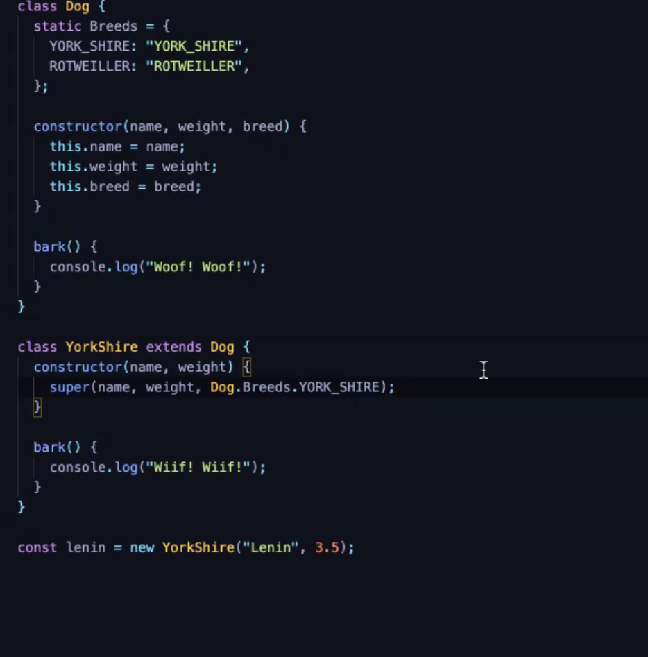
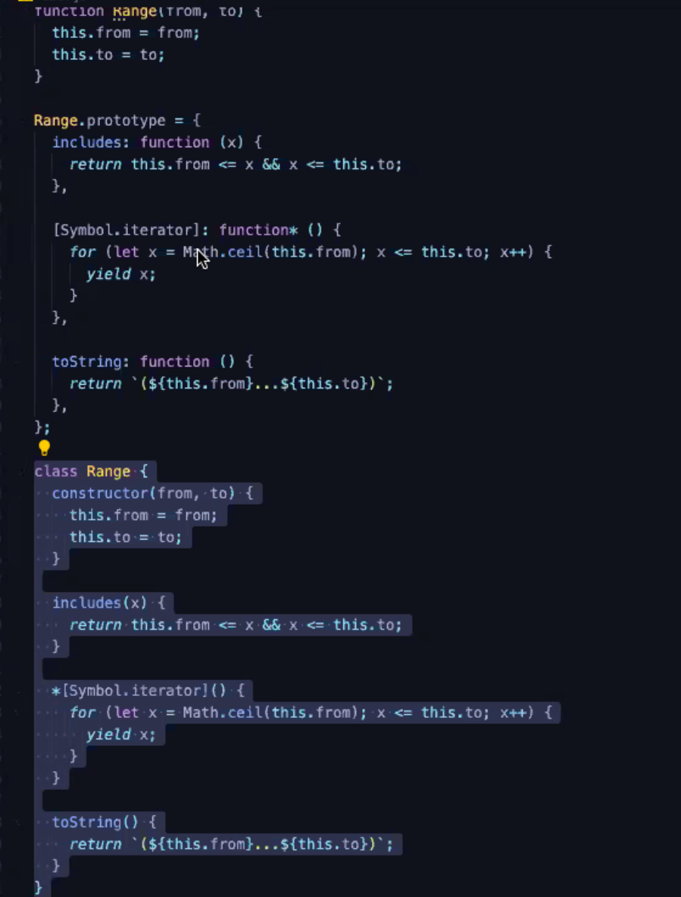
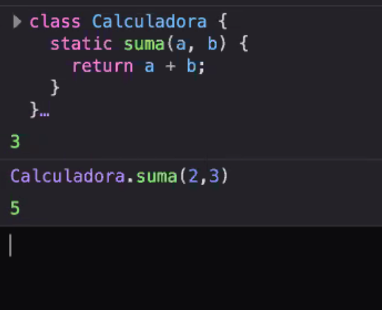

# OBJETOS

Son valores compuestos, es un agregado de otros valores, nos permite guardar o tener dichos valores por un nombre. Es una colección no ordenada de propiedades que tienen un nombre y un valor.

Es un mapa de strings a valores.

En Phyton diccionarios

Es algo más que un mapa de strings, además de mantener las propiedades, también hereda las propiedades de otros objeto.

## MÉTODOS DE UN OBJETO

Son heredados que vienen de su prototype.

Los objetos son dinámicos, pero pueden ser usados con estructura con un tipado fuerte.

No se pueden duplicar propiedades.

Cualquier valor que no es un primitivo es un booleano. Pero los primitivos también se comportan con primitivos.

for in: esto nos permite recorrer los objetos.
Cuando esto se hace no se muestran las propiedades heredadas

El valor puede ser un "string"

`const foo = Symbol("foo") const x = { [foo]: {} }`

Las propiedades de js son mutables, leibles, devueltas.

No se subescribe un objeto fundamental. Te lo importas y lo cambias.

## Literal de un objeto ¿Cómo se crea?

Expresión inicializadora

`const empty = {x: 0, y: "Moni"};

const book = {
"main title": "ex",
}

## Operador New

Este crea e inicializa un nuevo objeto.

Seguida de un constructor, hay algunos que te los da el propio js.

const o = new Object();
const a = new Date();

Todos los objetos tienen un prototipo, todos los que estan creados con el literal de objeto, todos tienen el mismo prototipo que es Object.prototype

Los prototipos son los objetos asociados de objeto de donde heredan propiedades.

Un objeto creado con new Object hereda de Object.prototype, pero todos heredan de el.

Todos los objetos tienen un prototipo pero solo unos pocos tienen la propiedad prototype, todos los demás las heredan de ellos.

Object.prototype no tiene prototipo es el prototipo primigenio, herencia de cadena de prototipos.

El Object.prototype es del que todos los demás objetos heredan las propiedades de object.

const o1 = Object.create({x:1,y:2})
o1 hereda las propiedades de object x e y,

const o2 = Object.create({new Date})
En este caso o2 hereda las propiedades de new Date, osea que este sería su prototipo. Pero el no posee esas propiedades en si mismo.

## CREAR UN OBJETO VACÍO

const o3 = Object.create(Object.prototype)

Object.create acepta un nuevo argumento, más propiedades

El uso común que le damos a object.create, protegemos todas sus funciones, ante mod

const o = {x:"3"}
library.function(Object.create(o))

Estas creando una copia, de o, nunca estas trabajando con el propio o sino con las propiedades que este tiene dentro, pero no lo puedes mutar.

## NORMALMENTE USAREMOS LA INICIACIÓN NORMAL CON CORCHETES

Para acceder a los valores
notación por . la izquierda debe ser el objeto y la derecha tiene que ser un notificador simple. Esto es para acceder a propiedad fija

Por corchetes podemos meter un string object
Arrays asociativos

En js se pueden crear cualquier tipo y numero de propiedades
object.property = esto es estático no se puede mutar
pero object["property"] si se puede mutar
Esto nos sirve para cuando la propiedad no está definida, ósea nosotros no sabemos que valor va a tener.

DELETE NUNCA LO VAMOS A USAR, HAREMOS EL OBJETO NULL, convertir a null

# HERENCIA

Los objetos tienen propiedades propias y heredadas del prototipo.
Si intentamos acceder a las propiedades propias de un objeto y no existe esta, se va a buscarla a las del prototipo

INVESTIGAR SOBRE OBJECT.PROTOTYPE

La herencia ocurre para consultar propiedades, solo de lectura

Chain operator



# JSON.stringfy

JSON.stringfy({x: 1}): te convierte un objeto en string

Con esto podemos comparar si dos objetos son iguales

# JSON.parse

Nos convierte de string a objeto

# MÉTODOS

const point = {
x:1,
y:2,
toString() {
return "lo que sea"
}
}

const LibraryBuilder = () => {(

    books: {}

)};

# CLASES



Miembros o estancias de una clase guardarán un estado interno y unas propiedades comunes.

Herencia basada en prototipos, y las clases no existen, solo son azúcar sintáctico para decir herencia basada en prototipos.

    class CarritoCompra {}

    const carritocompra = new CarritoCompra;

```js
function Range { }let r = new Range(1,3);
class Range {
constructor(from, to) {
this.from = from;
this.to = to;
}

    includes(x) {
        return this.from <= x && x <= this.to;
    }

}
```

## **Static**

Es una propiedad de la clase que no hace falta incializar con el New, podemos acceder con ., y son propiedades que están cerradas con los mismos valores.



Constructor

get y set, nos permite con la propiedad con \_ delante, encapsular

## HERENCIA

REGLA: SOLO DOS NIVELES DE HERENCIA COMO MÁXIMO, NO ABUSAR DE ELLO.
